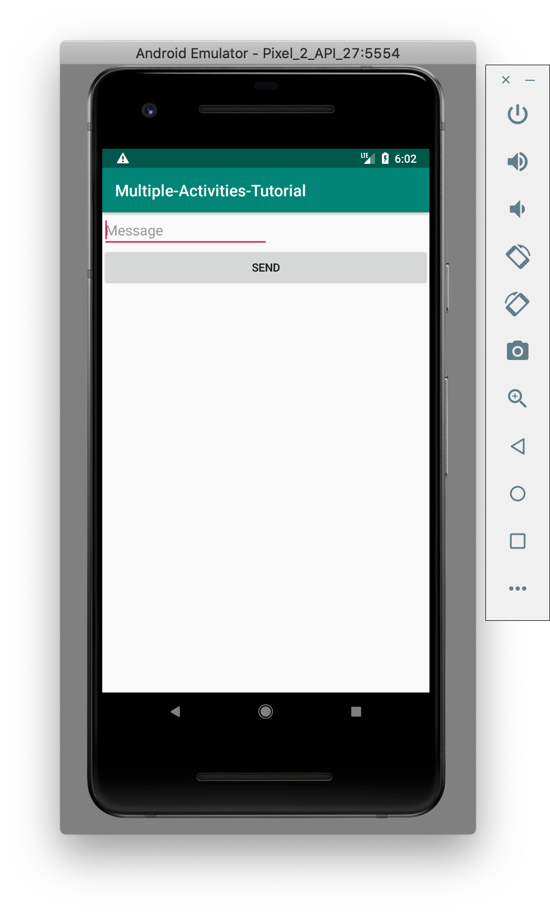
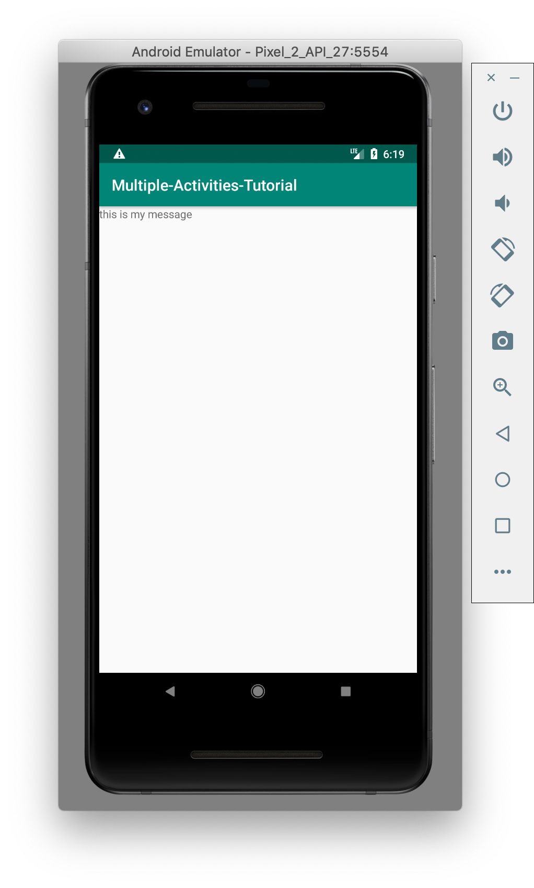

# Multiple Activities Tutorial

## Setup
Make sure you have Android Studio installed and create a new project from the main screen. Select "Empty Activity" when creating the Activity.

## What is an Activity?
In the Android OS, an Activity is analogous to a window on a Desktop OS. Every app has at least one Activity where all the UI is rendered and most of the user interaction takes place.

## How do I create an Activity?
In Android Studio, if you right click on the source package and hover over "new" there will be an option to create an Activity.


Let's create a new empty Activity. Follow that menu and enter the name "SecondActivity" and press "Create". Android Studio will automatically do a few things:
1. Create SecondActivity.java and populate it with boilerplate code.
2. Create a layout xml file for the Activity. This will be `res/layout/activity_second.xml`.
3. Add an Activity definition to `AndroidManifest.xml`. This is how the Android OS knows what Activities the app provides.

## Adding UI to the MainActivity
Now that we've created our second Activity, let's add UI to the one generated when we created the project. Go to the left hand side of Android Studio and select `res/layout/activity_main.xml`. Make sure you select the "Design" tab at the bottom. Right click on all the elements in the "Component Tree" and press Delete.


You won't be able to delete the ConstraintLayout, so just go to the Text tab and change "ConstraintLayout" to "LinearLayout". The XML should look like this:
```xml
<?xml version="1.0" encoding="utf-8"?>
<LinearLayout xmlns:android="http://schemas.android.com/apk/res/android"
    xmlns:tools="http://schemas.android.com/tools"
    android:layout_width="match_parent"
    android:layout_height="wrap_content"
    android:orientation="vertical"
    tools:context=".MainActivity">
```
Also, make sure you add the android:orientation line and make layout_height wrap_content!

Now, navigate to the "Design" tab and grab a "Plain Text" or "Edit Text" widget from the Palette, dragging it under the LinearLayout.


Rename its id to "messageText", remove the "Name" from text, and set the hint to "Message" all in the right hand side attributes panel.


Drag a Button into the LinearLayout as well and make its text "Sent" and its id "sendButton".

Now, run the app to see what it looks like!



## Adding Functionality to the MainActivity
Now that we have UI, we need to make the UI do something. What we want to do is open the second activity when the button is pressed, and populate a view with whatever message we have typed in the message field.

First, let's add functionality when the button is pressed. We do this by creating a OnClickListener.

Add this code to the bottom of the `onCreate()` function in `MainActivity.java`:
```Java
Button sendButton = findViewById(R.id.sendButton);

sendButton.setOnClickListener(new View.OnClickListener() {
    @Override
    public void onClick(View view) {
        Intent intent = new Intent(MainActivity.this, SecondActivity.class);
        startActivity(intent);
    }
});
```
What we are doing here is first getting a Java object of our Button so that we can access it within the code. Then we are setting an OnClickListener that will run every time the button is clicked. When clicked, we create an Intent, which is just an Android word for the intention for the app to do something. Basically, we are saying that we intend to go from the current activity to SecondActivity. Then we call `startActivity` to make that happen. If we run the app and press the button, it should show the SecondActivity. If you press the back button, it should go back to the MainActivity.

## Sending the Message to the Second Activity
In order to pass the message along to the next activity, we have to add it to the intent. If we do this, then the SecondActivity can grab this value and use it.

Change your `onCreate()` code in MainActivity to look like this:
```Java
final Button sendButton = findViewById(R.id.sendButton);
final EditText messageText = findViewById(R.id.messageText);

sendButton.setOnClickListener(new View.OnClickListener() {
    @Override
    public void onClick(View view) {
        String message = messageText.getText().toString();

        Intent intent = new Intent(MainActivity.this, SecondActivity.class);
        intent.putExtra("message_key", message);
        startActivity(intent);
    }
});
```
What we've added is first an object for the EditText, so that we can grab the actual message typed in. Then, in the `onClick()` method, we grab that text and put it into a string. Then, before we start the second activity, we put this string in the Intent, with the key "message_key". Now, SecondActivity can grab the message by using the same key.

## Adding UI to SecondActivity
Go to the file: `res/layout/activity_second.xml` and go to the Text tab. Put this in the xml file:
```xml
<?xml version="1.0" encoding="utf-8"?>
<LinearLayout xmlns:android="http://schemas.android.com/apk/res/android"
    xmlns:tools="http://schemas.android.com/tools"
    android:layout_width="match_parent"
    android:layout_height="wrap_content"
    tools:context=".SecondActivity">

    <TextView
        android:id="@+id/message"
        android:layout_width="wrap_content"
        android:layout_height="wrap_content" />
</LinearLayout>
```
Basically, all we have in this Activity is a TextView to display the message.

## Adding Functionality to SecondActivity
Now, we need to grab the String that we passed in through the Intent and use it to populate SecondActivity's View. Go to `SecondActivity.java` and add this piece of code to the end of `onCreate()`:
```Java
String message = getIntent().getStringExtra("message_key");
TextView messageView = findViewById(R.id.message);
messageView.setText(message);
```
All we are doing here is grabbing the message by using the same key and then setting the TextView's text to be the message. Here's what the app should look like:




That's all there is to it!